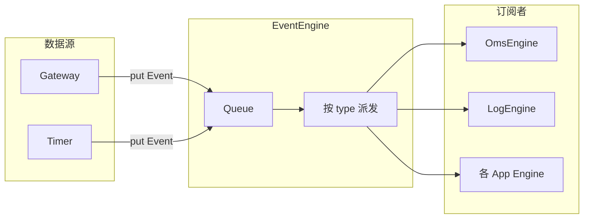
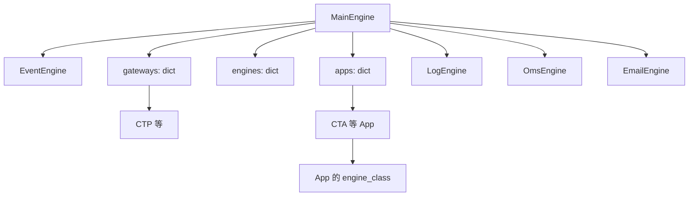

# VeighNa（vnpy）项目分析

## 1. 项目概览

| 项目         | 说明                                                                                    |
| ---------- | ------------------------------------------------------------------------------------- |
| **名称**     | VeighNa（原 vnpy）                                                                       |
| **版本**     | 4.3.0                                                                                 |
| **类型**     | Python 开源量化交易系统开发框架                                                                   |
| **许可**     | MIT                                                                                   |
| **Python** | 3.10+（推荐 3.13）                                                                        |
| **构建**     | [pyproject.toml](../pyproject.toml) + hatchling，无 setup.py/requirements.txt |


**定位**：面向私募、券商、期货等机构的量化交易开发框架，支持策略与模块二次开发；4.0 起新增 AI 量化模块 `vnpy.alpha`（多因子/机器学习），设计参考微软 Qlib。

---

## 2. 技术栈与依赖

- **GUI**：PySide6、pyqtgraph、qdarkstyle  
- **数据/科学计算**：numpy、pandas、ta-lib  
- **通信**：pyzmq（RPC）、plotly  
- **工具**：loguru、tqdm、nbformat  
- **可选 alpha**：polars、scipy、scikit-learn、lightgbm、torch、alphalens-reloaded、pyarrow  
- **开发**：ruff（lint）、mypy（类型检查）

---

## 3. 仓库结构

```
vnpy/
├── vnpy/                 # 主包
│   ├── event/             # 事件引擎
│   ├── trader/            # 交易核心（engine、gateway、app、object、ui、database、datafeed 等）
│   ├── alpha/             # AI 量化（dataset、model、strategy、lab）
│   ├── chart/             # K 线图表
│   └── rpc/               # 跨进程 RPC（client/server/common）
├── examples/              # 示例（veighna_trader、cta_backtesting、alpha_research、client_server 等）
├── docs/                  # 文档
├── tests/                 # 测试
├── pyproject.toml
├── install.bat / install.sh / install_osx.sh
└── README.md, CHANGELOG.md
```

---

## 4. 核心架构

### 4.1 事件驱动模型



- **Event**：[vnpy/event/engine.py](../vnpy/event/engine.py) 中 `Event(type, data)`，`type` 为字符串，用于路由。  
- **EventEngine**：单线程从 `Queue` 取事件，`_process()` 中先按 `event.type` 调用 `_handlers[type]`，再调用 `_general_handlers`；另有一线程按间隔产生 `EVENT_TIMER`。  
- **注册**：`register(type, handler)` / `register_general(handler)`，Gateway 与各 Engine 通过 `event_engine.put(Event(...))` 发事件，通过 `register` 收事件。

### 4.2 主引擎与组件关系



- **MainEngine**（[vnpy/trader/engine.py](../vnpy/trader/engine.py)）：  
  - 持有 `event_engine` 并 `start()`；  
  - `add_gateway(gateway_class)`：实例化 Gateway，放入 `gateways`，并汇总其 `exchanges`；  
  - `add_app(app_class)`：实例化 App 放入 `apps`，再 `add_engine(app.engine_class)` 把该 App 的引擎加入 `engines`；  
  - 内置 `LogEngine`、`OmsEngine`、`EmailEngine`，并把 OMS 的 get_tick/get_order/… 等委托给 MainEngine 对外暴露。
- **BaseGateway**（[vnpy/trader/gateway.py](../vnpy/trader/gateway.py)）：抽象类，通过 `on_tick`、`on_order`、`on_trade` 等将数据封装为 `Event` 后 `event_engine.put()`；需实现 `connect/close/subscribe/send_order/cancel_order/query_account/query_position` 等。  
- **BaseApp**（[vnpy/trader/app.py](../vnpy/trader/app.py)）：定义 `app_name`、`engine_class`、`widget_name` 等；实际 Gateway/App 以独立包（如 vnpy_ctp、vnpy_ctastrategy）提供，在用户 `run.py` 中 `add_gateway`/`add_app`。

### 4.3 交易事件类型与 OMS

- 事件类型（[vnpy/trader/event.py](../vnpy/trader/event.py)）：`EVENT_TICK`、`EVENT_ORDER`、`EVENT_TRADE`、`EVENT_POSITION`、`EVENT_ACCOUNT`、`EVENT_CONTRACT`、`EVENT_QUOTE`、`EVENT_LOG` 等；Gateway 还会推送「类型+vt_symbol」等细粒度事件。  
- **OmsEngine**：订阅上述交易相关事件，维护 `ticks/orders/trades/positions/accounts/contracts` 等字典，并为各 Gateway 维护 `OffsetConverter`，供开平转换等使用。

### 4.4 数据对象

- [vnpy/trader/object.py](../vnpy/trader/object.py)：统一数据结构，如 `TickData`、`BarData`、`OrderData`、`TradeData`、`PositionData`、`AccountData`、`ContractData` 以及请求类 `OrderRequest`、`CancelRequest`、`SubscribeRequest`、`HistoryRequest` 等，均为 dataclass，含 `gateway_name`、`vt_symbol`/`vt_orderid` 等统一标识。

---

## 5. 主要模块说明

- **vnpy.event**：事件引擎，整个系统解耦与驱动的核心。  
- **vnpy.trader**：交易核心。包含 engine（MainEngine、Log/Oms/Email）、gateway/app 抽象、object/constant、database/datafeed 接口、converter、optimize、setting、locale、UI（MainWindow、create_qapp）等。  
- **vnpy.alpha**：4.0 新增。  
  - **dataset**：因子特征（Alpha 158/101、表达式引擎、processor、ta/cs/ts 等函数）。  
  - **model**：Lasso、LightGBM、MLP 等模型模板与统一接口。  
  - **strategy**：基于模型信号的策略与回测。  
  - **lab**（[vnpy/alpha/lab.py](../vnpy/alpha/lab.py)）：投研流程（数据目录、dataset/model/signal 路径、保存/加载 bar、数据集、模型、信号与回测）。
- **vnpy.chart**：K 线图表（widget、manager、axis、item、base）。  
- **vnpy.rpc**：RPC 客户端/服务端与公共定义，用于分布式部署。

---

## 6. 运行与扩展方式

- **图形化**：通过 VeighNa Station 启动 VeighNa Trader，或自写脚本：创建 `EventEngine` → `MainEngine(event_engine)` → `add_gateway`/`add_app` → `MainWindow(main_engine, event_engine)` → `qapp.exec()`。示例入口：[examples/veighna_trader/run.py](../examples/veighna_trader/run.py)。  
- **扩展**：  
  - **交易/行情**：实现 `BaseGateway` 子类（如 vnpy_ctp），在 run.py 中 `add_gateway(CtpGateway)`。  
  - **策略/功能**：实现 `BaseApp` 及其 `engine_class`（及可选 UI），在 run.py 中 `add_app(CtaStrategyApp)`。
- 多数 Gateway 与 App 以独立仓库（如 vnpy_ctp、vnpy_ctastrategy）发布，需单独安装；核心库只提供抽象与事件流。

---

## 7. 小结

VeighNa 采用**事件驱动 + 主引擎 + 网关/应用插件化**的架构：EventEngine 负责事件队列与按类型派发；MainEngine 管理 Gateways、内置 Engines（Log/Oms/Email）以及由 App 注册的 Engines；Gateway 将行情与委托回报转为统一 Event 推送；各 App 通过自己的 Engine 订阅事件并执行业务逻辑。数据层通过 trader.object 与 database/datafeed 抽象统一；4.0 的 alpha 模块在同样数据与事件体系上叠加了因子、模型、策略与 lab 投研流程，可与现有 CTA/组合等应用配合使用。
