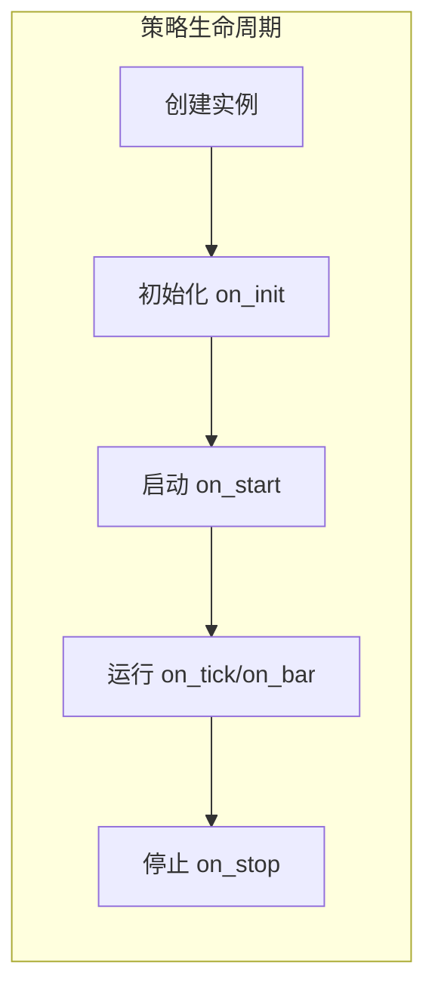

# 量化与 VeighNa 业务概念速览

本文面向零业务基础的新同学：先建立概念，再动手写策略。只讲「是什么」和「在 VeighNa 里对应什么」，不涉及代码。

## 本文说明

若你刚开始接触量化交易和 VeighNa，建议先通读本文建立业务概念，再按 [新同学编程入门与实操](newcomer_quickstart.md) 一步步跑通第一个策略。若已熟悉量化术语，可直接跳转到编程文档。

## 量化交易与 CTA 是什么

- **量化交易**：用程序根据既定规则自动或半自动地执行交易决策，而不是完全凭人工主观判断。规则可以基于技术指标、统计模型、价差等。
- **CTA**（Commodity Trading Advisor，管理期货）：一类以期货等衍生品为标的的量化策略，通常按趋势、波动率等信号在单合约或多合约上交易。VeighNa 中的 **CTA 策略引擎**就是为这类策略设计的：单合约、由 K 线或 Tick 行情驱动、支持回测与实盘同一套代码。
- 与「主观交易」的对比：主观交易依赖人脑判断；量化交易把规则写成代码，由程序执行，便于回测和风控。

## 回测与实盘

- **回测**：用历史行情数据在本地运行策略逻辑，统计盈亏、胜率、回撤等指标，**不会真实下单**。用来验证思路和参数是否有效。
- **实盘**：连接交易所或期货公司的交易柜台，发出真实委托，资金真实成交。
- **在 VeighNa 中**：回测可用 **CtaBacktester** 图形界面或脚本/Notebook；实盘用 **VeighNa Trader** 搭配 **CtaStrategy** 模块。同一份策略代码既可以给回测引擎用，也可以给实盘引擎用，只需在相应界面或脚本中加载即可。

## 行情与合约

- **Tick**：逐笔成交或委托的快照数据，包含最新价、买卖盘口、成交量等。频率高、数据细，适合做高频或对盘口敏感的策略。
- **K 线（Bar）**：按时间周期（如 1 分钟、1 小时、日线）聚合后的数据，一般包含开高低收（OHLC）和成交量。策略里常用「Tick 合成 K 线 → 再算技术指标」的方式。
- **vt_symbol**：VeighNa 里用来唯一标识一个合约的字符串，格式为「合约代码 + 交易所」，例如 `IF888.CFFEX`（股指期货连续合约）、`rb2501.SHFE`（螺纹钢某月合约）。在策略、回测、实盘中都会用到。
- 策略开发时：要么用 **Tick → 合成 K 线 → 在 K 线上算指标、发信号**，要么直接用 **Tick** 驱动逻辑；CTA 模板里常用前者。

## 策略在引擎中的生命周期

策略在回测或实盘引擎中会经历固定阶段，引擎会在相应时机调用策略里的回调函数（你写逻辑的地方）：

1. **创建实例**：引擎根据你选择的策略类和参数，创建一个策略对象。
2. **初始化**：加载一段历史数据、计算指标（如均线），此时**还不能发单**。对应回调 `on_init`。
3. **启动**：初始化完成后引擎调用 `on_start`，策略进入可交易状态。
4. **运行**：持续接收行情（Tick 或 K 线），策略在 `on_tick` / `on_bar` 里根据规则计算并发出买卖指令。
5. **停止**：用户停止策略或程序退出时，引擎调用 `on_stop`，可在这里做收尾（如写日志）。

## VeighNa 常用名词与入口

- **VeighNa Station**：官方图形化管理工具，用来启动 VeighNa Trader、选择要加载的应用模块（如 CTA 策略、CTA 回测）等。
- **VeighNa Trader**：带图形界面的交易客户端。连接交易接口（如 CTP）、加载策略、查看持仓与成交等，都在 Trader 里完成。
- **strategies 目录**：Trader 的**运行目录**下有一个 `strategies` 文件夹；你写的策略脚本需要放在这里，才能在 CTA 策略、CTA 回测等界面里被识别和加载。运行目录路径可在 Trader 主窗口标题栏看到。

更多功能与模块说明见 [功能介绍](introduction.md)；具体操作可继续看 [CTA策略](../app/cta_strategy.md)、[CTA回测](../app/cta_backtester.md)。
